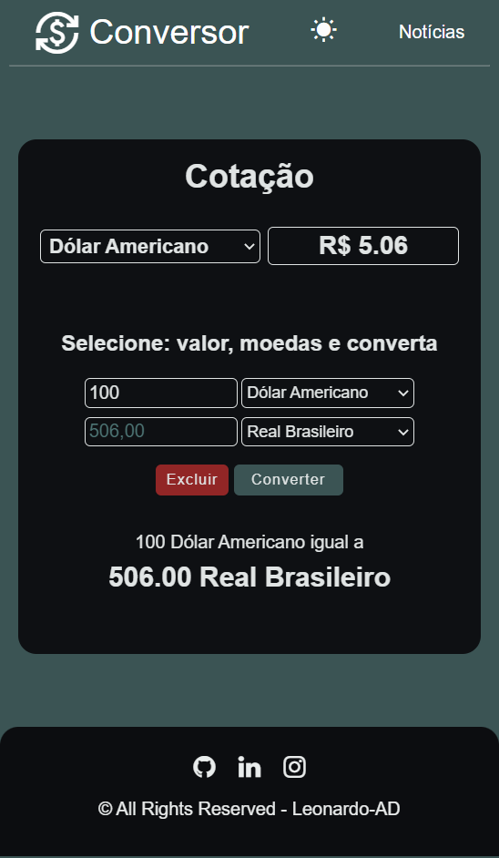

<h1 align='center'>Currency-Converter</h1>

This is just a simple currency converter project to improve my basic knowledge. In this app I am using HTML, CSS, JavaScript and Sweet Alert.

## Features Developed

- [x] Show some currency quotes
- [x] Convert amounts to different currencies
- [x] Clear all values
- [x] Dark/Light mode
- [x] Responsivity

## Screenshots

When trying to convert without a value, an alert from the SweetAlert2 API appears

 

In the dropdown menu we have some currency options

Adding and converting currency values

We have a light mode and a dark mode, to change just click on the top center icon

On mobile screens

      

## Technologies

## Services Used

</a>

## Deploy

You can access the project by clicking the button below.

## Autor

<table>
  <tr>
    <td align="center">
      <a href="https://github.com/leonardo-ad">
       
      <b>Leonardo Alves Dias</b>
        
      <a href="https://www.linkedin.com/in/leonardo-alves-877368165/"> 
    </td>
   </tr>
</table>
